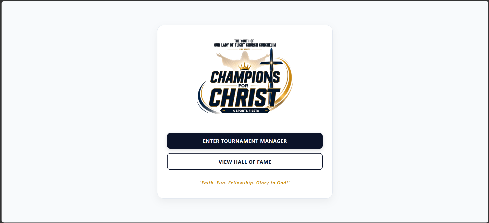
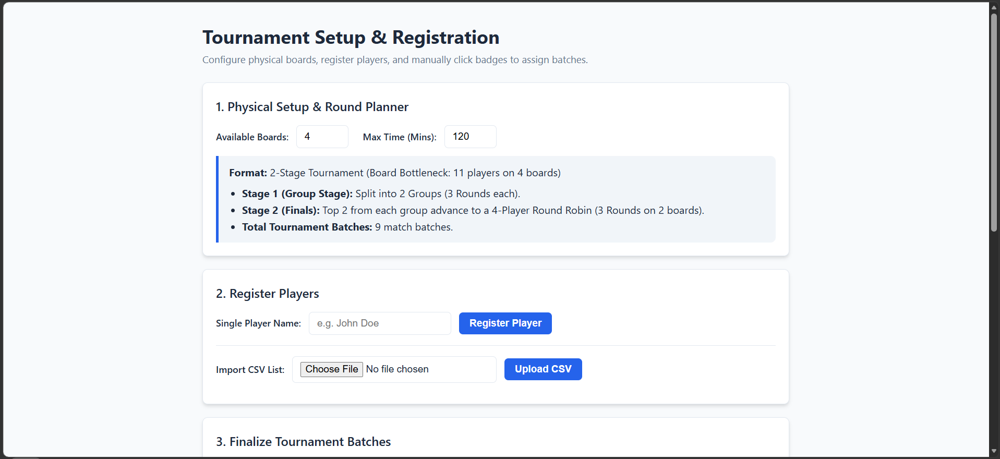
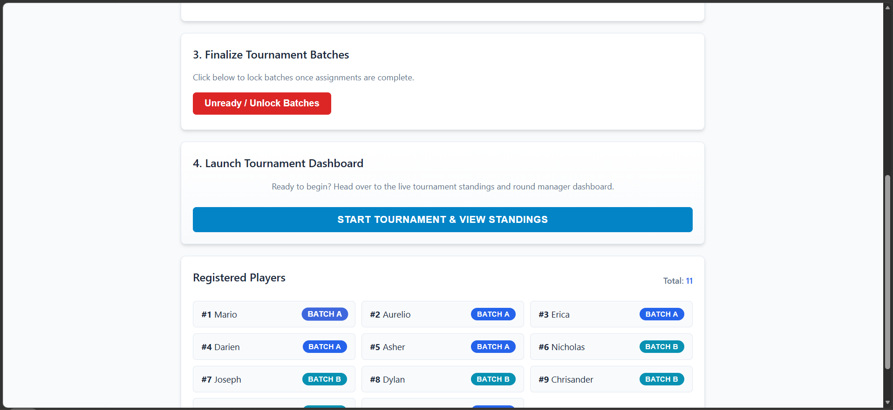
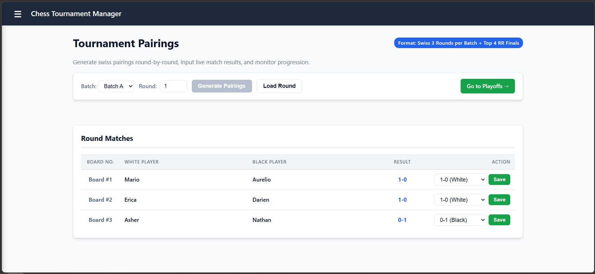
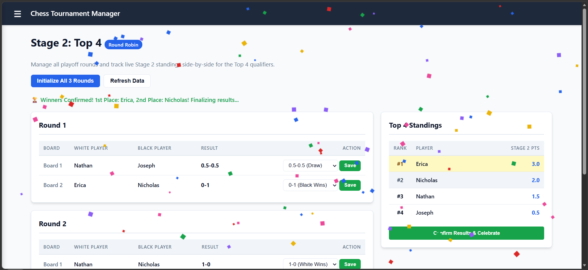
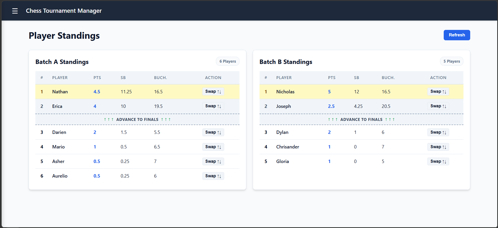

♟️ Parish Chess Tournament Manager

A lightweight, local-first web application designed to manage chess tournaments effortlessly. It handles everything from player registration and manual or automatic batch assignment (Batch A & Batch B) to round generation (Swiss / Round Robin), live standings, tie-breaks, and playoffs.

✨ Features
Player Registration & Management: Add individual players manually or import a roster via CSV.

Manual Batch Assignment: Interactive player badges that let you toggle and assign players between Unassigned, Batch A, and Batch B with a single click.

Dynamic Round Planner & Setup: Configure available physical boards and maximum time windows with automated format recommendations.

Automated Pairings: Supports Swiss-system and Round-Robin pairings depending on player count and stage.

Stage & Playoff Management: Manage multi-batch stages, tie-breaks, and final playoffs (Semi-finals / Finals).

Match Scoring & Live Standings: Real-time scoreboard updates with automatic point tracking and tie-break calculations (Buchholz, Sonneborn-Berger).

🛠️ Tech Stack
Frontend: HTML5, CSS3, Vanilla JavaScript (Responsive UI)

Backend: Node.js, Express.js

Database: SQLite (via better-sqlite3)

File Processing: multer & csv-parser for CSV roster imports

🚀 Getting Started
Follow these instructions to get a local copy up and running on your machine.

Prerequisites
Make sure you have the following installed on your system:

Node.js (v16+ recommended)

npm (comes with Node.js)

Installation & Setup
Clone the repository:

Bash
git clone https://github.com/SergioCarmoDias/chess-tournament-app.git
cd your-repo-name
Install dependencies:

Bash
npm install
(Ensure you have packages like express, better-sqlite3, multer, and csv-parser installed based on your project structure).

Run the server:

Bash
node server.js
# or if using nodemon / npm start
npm start
Open the app:
Open your browser and navigate to:
http://localhost:3000 (or the port specified in your app).

📖 How to Use
Setup Boards: Head over to the Setup page to configure your available physical chess boards and time limits.

Register Players: Type player names individually or upload a CSV file containing your participant list.

Assign Batches: Click on player batch badges to assign them manually to Batch A or Batch B as needed.

Launch Rounds: Generate pairings, record match results (1-0, 0-1, 0.5-0.5), and track live standings up through the finals and playoffs!
